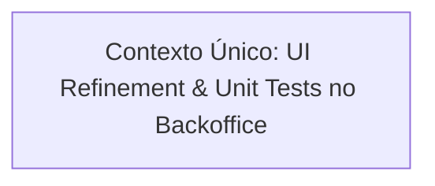

# 📐 Plano de Execução Técnica: Refinamentos de UI/UX no Backoffice

Este plano foi formulado pelo **Nexus Tech Planner** com base nos ajustes solicitados para o modal e formulário de cadastro de produtos no **Backoffice**, respeitando as restrições arquiteturais de [`rules/RESTRICTIONS.md`](../../rules/RESTRICTIONS.md) e as convenções do repositório.

---

## 1. Visão Geral e Estratégia de Contextos

- **Resumo da Entrega:** Refinar a experiência e acessibilidade do formulário de criação de produtos no Backoffice:
  1. Centralização perfeita do botão de fechar com o título do diálogo.
  2. Máscara monetária dinâmica em Real (`R$`) no campo de preço, garantindo envio do valor numérico limpo (*raw*) para a API Go.
  3. Limitação e contador de caracteres na descrição do produto (limite adequado definido em **500 caracteres**).
  4. Centralização e alinhamento visual completo do ícone e textos da caixa de upload de imagem.
  5. Layout dos botões de ação empilhados verticalmente (um abaixo do outro), ambos com largura total (`100% width`) e conteúdo centralizado.
- **Nível de Complexidade:** **Simples / Média** (Front-end focado em React 19, Tailwind/CSS Modules, Chakra UI v3 e testes unitários Jest).
- **Quantidade de Contextos/Sessões:** **1 Contexto Sequencial**.
- **Grafo de Dependência:**



---

## 2. Checklist Técnico Global (`[x]`)

- [x] **Alinhamento do Cabeçalho do Diálogo (`apps/frontend/backoffice/src/pages/products/index.tsx`)**:
  - [x] Ajustar alinhamento vertical entre `Dialog.Title` e o botão fechar com `inline-flex items-center justify-center` e reset de line-height.
  - [x] Aplicar o mesmo padrão em `home/index.tsx` para consistência institucional.
- [x] **Utilitários de Máscara de Preço (`apps/frontend/backoffice/src/shared/utils/format.ts`)**:
  - [x] Implementar `formatCurrencyInput(value: string): string` (formatação progressiva baseada em centavos).
  - [x] Implementar `parseCurrencyToRaw(value: string): number` (extração do float numérico real).
  - [x] Adicionar testes unitários em `format.test.ts`.
- [x] **Formulário de Produto (`apps/frontend/backoffice/src/pages/products/components/ProductForm/`)**:
  - [x] Integrar máscara `R$` no input de preço e garantir envio do valor raw formatado (`rawPrice.toFixed(2)`) no `FormData`.
  - [x] Adicionar limite máximo de 500 caracteres no textarea da descrição, validação e contador visual `X / 500`.
  - [x] Ajustar estilos da caixa de upload (`styles.uploadBox`) para centralização vertical e horizontal de ícone, textos e botão.
  - [x] Reestruturar botões de ação em coluna 100% width: botão principal "Criar Produto" no topo e botão "Cancelar" logo abaixo.
- [x] **Garantia de Qualidade & Testes**:
  - [x] Atualizar suíte de testes em `ProductForm/__tests__/index.test.tsx` validando máscara, limite de caracteres e envio do preço raw.
  - [x] Executar `npm test` no Backoffice garantindo 100% de testes passando sem regressões.

---

## 3. Prompts de Execução para Agentes (Ready-to-Run)

### Contexto 1: UI Refinements & Máscara no Backoffice

```markdown
### AGENTE ALVO: frontend-specialist

Você deve aplicar os refinamentos visuais e de interação no formulário de produtos e cabeçalho de diálogo do Backoffice.

#### Contexto & Dependências
- Diretório de trabalho: `apps/frontend/backoffice/`.
- Stack: React 19, Vite 8, Chakra UI v3, TailwindCSS + CSS Modules, Jest e React Testing Library.
- Regras Críticas:
  - Respeitar estritamente `rules/RESTRICTIONS.md`.
  - Código limpo, sem `any`, totalmente tipado em TypeScript e sem textos em português em variáveis/funções (código em inglês, textos de tela e validações em português).
  - Manter integridade de todos os testes existentes.
- Skills Obrigatórias a consultar:
  - `skills/frontend/react/SKILL.md`
  - `skills/frontend/design/SKILL.md`
  - `skills/frontend/web-interface-guidelines/SKILL.md`
  - `rules/RESTRICTIONS.md`

#### Instruções Técnicas

1. **Utilitários de Máscara de Moeda (`apps/frontend/backoffice/src/shared/utils/format.ts`)**:
   - Adicionar as funções:
     - `formatCurrencyInput(value: string): string`: remove caracteres não-dígitos e formata como `R$ 0,00` (ex: dígitos `'14990'` -> `'R$ 149,90'`). Se vazio, retorna `''`.
     - `parseCurrencyToRaw(value: string): number`: extrai o float numérico correspondente (ex: `'R$ 149,90'` -> `149.90`).
   - Cobrir os cenários no arquivo de teste `src/shared/utils/__tests__/format.test.ts`.

2. **Alinhamento do Título com Botão Fechar (`apps/frontend/backoffice/src/pages/products/index.tsx`)**:
   - No `Dialog.Header`:
     - Configurar a barra de título como flexbox perfeitamente alinhado:
       ```tsx
       <div className="flex items-center justify-between w-full">
         <Dialog.Title fontSize="1.25rem" fontWeight="700" color="#f8fafc" letterSpacing="-0.02em" margin="0" lineHeight="1.2">
           Cadastrar Novo Produto
         </Dialog.Title>
         <button
           type="button"
           onClick={() => setIsDialogOpen(false)}
           aria-label="Fechar diálogo de cadastro de produto"
           className="inline-flex items-center justify-center p-1.5 text-[#94a3b8] hover:text-[#f8fafc] rounded-md transition-colors leading-none"
         >
           <X size={20} aria-hidden="true" />
         </button>
       </div>
       ```
   - Aplicar a mesma centralização no modal de pedidos em `apps/frontend/backoffice/src/pages/home/index.tsx`.

3. **Formulário de Cadastro (`apps/frontend/backoffice/src/pages/products/components/ProductForm/index.tsx`)**:
   - **Máscara de Preço**:
     - O input `price` deve utilizar `formatCurrencyInput` no `onChange`.
     - No `handleSubmit`:
       - Extrair o valor com `const numericPrice = parseCurrencyToRaw(price)`.
       - Validar se `numericPrice > 0`. Caso contrário, exibir erro: `"Um preço positivo válido é obrigatório."`.
       - Anexar valor raw com ponto no `FormData`: `formData.append('price', numericPrice.toFixed(2))`.
   - **Limite de Descrição**:
     - Limite de 500 caracteres (`maxLength={500}`).
     - Contador visual abaixo do textarea: `<div className="flex justify-end mt-1"><span className="text-xs text-[#94a3b8]">{description.length}/500</span></div>`.
   - **Centralização do Upload**:
     - Garantir que o container `.uploadBox` e o bloco interno do ícone `<ImageIcon />`, textos informativos e botão "Selecionar Imagem" estejam com centralização total (`flex flex-col items-center justify-center text-center`).
   - **Botões 100% Width e Empilhados**:
     - Estruturar os botões com largura total, um abaixo do outro:
       ```tsx
       <div className="flex flex-col items-center gap-2.5 w-full mt-4">
         <button
           type="submit"
           disabled={isPending}
           className={styles.submitButton}
         >
           {isPending ? 'Criando Produto…' : 'Criar Produto'}
         </button>

         {onCancel && (
           <button
             type="button"
             onClick={onCancel}
             disabled={isPending}
             className={styles.cancelButton}
           >
             Cancelar
           </button>
         )}
       </div>
       ```
     - Atualizar `styles.module.css` garantindo `w-full justify-center text-center` tanto para `.submitButton` quanto para `.cancelButton`.

4. **Testes Unitários (`apps/frontend/backoffice/src/pages/products/components/ProductForm/__tests__/index.test.tsx`)**:
   - Atualizar a simulação de digitação no campo de preço para refletir a máscara e garantir que `submittedFormData.get('price')` contenha o valor numérico raw esperado (`89.99`).
   - Adicionar teste para o contador de limite de caracteres da descrição.

#### Critério de Sucesso
- Executar `npm test` dentro de `apps/frontend/backoffice/` e validar que todos os 13 test suites continuam passando com 100% de sucesso.
- Diálogo com botão fechar alinhado verticalmente com o título.
- Preço com máscara visual `R$` e envio raw decimal para a API.
- Descrição limitada em 500 caracteres com feedback de contagem.
- Caixa de upload centralizada e botões empilhados em 100% width.
```
