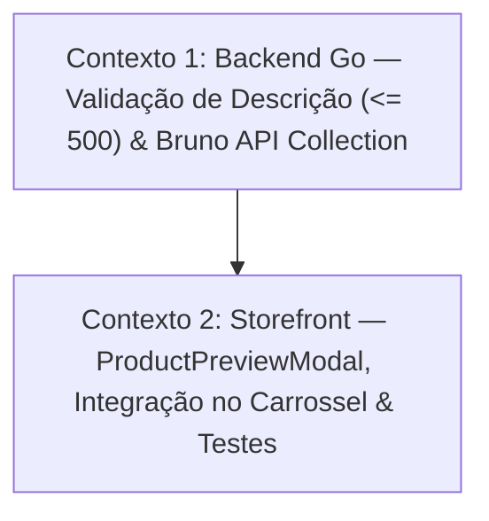

# 📐 Plano de Execução Técnica: Product Preview Modal no Storefront & Limite de Descrição

Este plano foi formulado pelo **Nexus Tech Planner** com base nos requisitos aprovados para o modal de **Product Preview (Quick View)** no **Storefront** e a regra de limite de até **500 caracteres** na descrição de produtos, respeitando as restrições arquiteturais de [`rules/RESTRICTIONS.md`](../../rules/RESTRICTIONS.md) e as convenções do monorepo.

---

## 1. Visão Geral e Estratégia de Contextos

- **Resumo da Entrega:**
  1. **Storefront:** Ao clicar em um produto na vitrine/carrossel, abrir um modal de prévia do produto (*Quick View Modal*) contendo imagem em destaque em alta resolução, preço formatado em Real, botão de ação ("Adicionar ao Carrinho") e a **descrição completa** cadastrada (suportando até 500 caracteres).
  2. **Carrossel do Storefront:** O card do carrossel (`ProductCard`) permanece exibindo apenas o preview/resumo curto truncado (95 caracteres) para manter o layout limpo e sem quebras visuais.
  3. **Backend (Go/Gin):** Validação estrita no endpoint `POST /api/products`, assegurando que `description` não ultrapasse 500 caracteres (com contagem correta de runas UTF-8).
  4. **Bruno API Collection:** Criação/atualização de arquivos de requisição no Bruno (`apps/backend/bruno/`) para testes da regra de 500 caracteres e payload válido.
- **Nível de Complexidade:** **Média** (Vertical Slice cruzando Go/Gin, Bruno Collection e Storefront Next.js/Tailwind).
- **Quantidade de Contextos/Sessões:** **2 Contextos Sequenciais**.
- **Grafo de Dependência:**



---

## 2. Checklist Técnico Global (`[ ]`)

- [ ] **Contexto 1 — Backend (Go/Gin) & Bruno Collection**:
  - [ ] Validar o tamanho do campo `description` no método `HandleCreateProduct` em [`apps/backend/service/products.go`](../../apps/backend/service/products.go) rejeitando textos com mais de 500 caracteres (`len([]rune(description)) > 500`) com status `400 Bad Request`.
  - [ ] Criar/atualizar a requisição no Bruno (`apps/backend/bruno/`) para validação de produto com descrição excedendo 500 caracteres e teste com descrição válida.
  - [ ] Garantir compilação limpa do backend Go (`go build ./...`).
- [ ] **Contexto 2 — Storefront (Next.js / TailwindCSS)**:
  - [ ] Criar o componente `ProductPreviewModal` em `apps/frontend/storefront/src/shared/components/ProductPreviewModal/` (`index.tsx`, `styles.module.css`).
  - [ ] Acessibilidade completa no modal (WAI-ARIA `role="dialog"`, `aria-modal="true"`, foco gerenciado, tecla `Escape`, clique no backdrop e botão de fechar `X`).
  - [ ] Exibir imagem ampliada em alta resolução com fallback elegante de erro, título completo, preço formatado em destaque e descrição integral com suporte a quebras de linha (`whitespace-pre-line`).
  - [ ] Adaptar `ProductCard` para disparar callback `onSelect?: (product: Product) => void` ao clicar no card/imagem/título.
  - [ ] Gerenciar o estado do produto selecionado no `ProductCarousel` e/ou `pages/index.tsx` para abrir o `ProductPreviewModal`.
  - [ ] Criar suíte de testes unitários em `ProductPreviewModal/__tests__/index.test.tsx` e atualizar testes de `ProductCard` e `ProductCarousel`.
  - [ ] Validar execução de testes Jest (`npm test`) e compilação do Next.js (`npm run build`).

---

## 3. Prompts de Execução para Agentes (Ready-to-Run)

### 🚀 Contexto 1: Backend Go — Validação de Descrição & Bruno API Collection

```markdown
### AGENTE ALVO: backend-specialist

Você deve implementar a validação de regra de negócio de limite máximo de 500 caracteres na descrição de produtos no Backend Go e documentar na coleção oficial do Bruno.

#### Contexto & Dependências
- Diretório de trabalho: `apps/backend/`.
- Stack: Go 1.27, Gin, PostgreSQL (Raw SQL com database/sql), Bruno API Collection.
- Regras Críticas:
  - Respeitar estritamente `rules/RESTRICTIONS.md`. É proibido executar `git commit` ou `git push`.
  - Proibido o uso de ORMs (Raw SQL apenas).
  - Obrigatório criar/atualizar a requisição correspondente no Bruno (`apps/backend/bruno/`) conforme regra 49 do `RESTRICTIONS.md`.
  - Variáveis, funções e mensagens de log/código estritamente em inglês.

#### Skills Obrigatórias a Consultar
- `skills/backend/golang-api-architecture/SKILL.md`
- `skills/backend/golang-clean-code-patterns/SKILL.md`
- `skills/backend/golang-error-handling/SKILL.md`
- `skills/backend/bruno-collection-generator/SKILL.md`
- `skills/backend/bruno-test-writer/SKILL.md`
- `rules/RESTRICTIONS.md`

#### Instruções Técnicas

1. **Validação de Descrição em `apps/backend/service/products.go`**:
   - No método `HandleCreateProduct`, logo após a leitura de `description := strings.TrimSpace(c.PostForm("description"))`:
     ```go
     if len([]rune(description)) > 500 {
         s.HandleResponseError(c, "Product description cannot exceed 500 characters", nil)
         return
     }
     ```
   - O uso de `[]rune(description)` garante que caracteres acentuados ou emojis UTF-8 não sejam superdimensionados em contagem de bytes.

2. **Coleção Bruno (`apps/backend/bruno/`)**:
   - Verificar os arquivos `.bru` existentes em `apps/backend/bruno/products/`.
   - Adicionar ou atualizar uma requisição para validar erro de descrição acima de 500 caracteres (`Create Product - Description Exceeds Limit.bru`).
   - Adicionar assertions/testes em Javascript do Bruno validando status `400` e mensagem de erro `"Product description cannot exceed 500 characters"`.

3. **Validação & Critério de Sucesso**:
   - Executar compilação do Go: `export PATH=$PATH:/usr/local/go/bin; go build ./...`
   - Testes e compilação sem erros.
```

---

### 🎨 Contexto 2: Storefront — Modal de Preview de Produto (Quick View) & Integração no Carrossel

```markdown
### AGENTE ALVO: frontend-specialist

Você deve criar o componente modal de prévia rápida do produto (Quick View) no Storefront e integrá-lo com o clique nos produtos da vitrine do carrossel.

#### Contexto & Dependências
- Diretório de trabalho: `apps/frontend/storefront/`.
- Stack: Next.js 16 (Pages Router), React 19, TailwindCSS, Lucide React, Jest e React Testing Library.
- Regras Críticas:
  - Respeitar estritamente `rules/RESTRICTIONS.md`. É proibido executar `git commit` ou `git push`.
  - Storefront utiliza exclusivamente Next.js e TailwindCSS (terminantemente proibido importar Chakra UI no storefront).
  - Padrão SSR obrigatório em `getServerSideProps` com `initialData` mantido na página inicial.
  - Código, variáveis e funções estritamente em inglês; rótulos de tela em português.
  - O card do carrossel (`ProductCard`) deve continuar mostrando apenas a descrição curta/preview truncada (95 caracteres); o modal deve exibir a imagem em destaque ampliada, preço e a descrição completa (até 500 caracteres).

#### Skills Obrigatórias a Consultar
- `skills/frontend/react/SKILL.md`
- `skills/frontend/design/SKILL.md`
- `skills/frontend/web-interface-guidelines/SKILL.md`
- `rules/RESTRICTIONS.md`

#### Instruções Técnicas

1. **Criação do Componente `ProductPreviewModal` (`src/shared/components/ProductPreviewModal/`)**:
   - Criar `index.tsx` e `styles.module.css`:
     - Interface de Props:
       ```typescript
       export interface ProductPreviewModalProps {
         product: Product | null
         isOpen: boolean
         onClose: () => void
       }
       ```
     - Estrutura Visual:
       - Fundo escurecido translúcido com desfoque de fundo (`fixed inset-0 z-50 bg-black/60 backdrop-blur-sm flex items-center justify-center p-4`).
       - Painel modal centralizado com fundo branco (`bg-white`), bordas suaves (`border border-slate-200`), cantos arredondados (`rounded-2xl`), largura máxima `max-w-2xl` ou `max-w-3xl` e sombra pronunciada.
       - Botão de fechar `X` no canto superior direito (`aria-label="Fechar prévia do produto"`).
       - Grade de 2 colunas no desktop (`grid grid-cols-1 md:grid-cols-2 gap-6 p-6`):
         - **Coluna da Esquerda (Imagem Ampliada):** Imagem do produto em alta resolução com proporção fixa (`aspect-square`), `rounded-xl`, moldura sutil e fallback com ícone `Package` caso a imagem não exista ou falhe.
         - **Coluna da Direita (Informações Detalhadas):**
           - Nome completo do produto (`text-2xl font-bold text-slate-900 leading-snug`).
           - Preço formatado em Real com grande destaque visual (`text-3xl font-extrabold text-blue-600`).
           - Selo de disponibilidade ("Em Estoque - Envio Imediato").
           - Divisor sutil (`border-t border-slate-200`).
           - Título da seção: "Descrição do Produto".
           - Texto da descrição completa sem cortes (suportando até 500 caracteres, permitindo formatação limpa e quebras com `whitespace-pre-line text-sm text-slate-600 leading-relaxed`).
           - Botão de ação "Adicionar ao Carrinho" com ícone `ShoppingCart` (desabilitado com tooltip ou badge "Disponível na Release 2").
     - Acessibilidade & Interatividade:
       - Pressionar a tecla `Escape` fecha o modal.
       - Clicar no backdrop fora do conteúdo fecha o modal.
       - Previne scroll do body quando o modal estiver aberto (`overflow: hidden` no body).

2. **Integração no `ProductCard` e `ProductCarousel`**:
   - Em `ProductCard` (`src/shared/components/ProductCard/index.tsx`):
     - Receber `onSelect?: (product: Product) => void`.
     - Tornar a imagem e o título clicáveis (ou o card com `cursor-pointer`), disparando `onSelect(product)`.
     - Preservar a descrição curta do carrossel (`truncateDescription(product.description, 95)`).
   - Em `ProductCarousel` (`src/shared/components/ProductCarousel/index.tsx`):
     - Repassar `onSelectProduct?: (product: Product) => void` para cada `ProductCard`.
   - Na página inicial (`src/pages/index.tsx`):
     - Adicionar estado:
       ```typescript
       const [selectedProduct, setSelectedProduct] = useState<Product | null>(null)
       ```
     - Ao clicar em um card, definir `setSelectedProduct(product)`.
     - Renderizar `<ProductPreviewModal product={selectedProduct} isOpen={Boolean(selectedProduct)} onClose={() => setSelectedProduct(null)} />`.

3. **Testes Unitários & Validação**:
   - Criar `src/shared/components/ProductPreviewModal/__tests__/index.test.tsx`:
     - Testar renderização do nome, preço formatado, imagem ampliada e descrição completa.
     - Testar fechamento via clique no botão `X`, clique no backdrop e pressionamento da tecla `Escape`.
     - Testar que o modal não renderiza nada quando `isOpen={false}` ou `product={null}`.
   - Atualizar testes de `ProductCard` e `ProductCarousel` cobrindo o disparo do clique de seleção.
   - Executar validação no Storefront: `npm test -- --runInBand` e `npm run build`.
```

---

## 4. Persistência e Rastreabilidade

- Arquivo do Planner: [`docs/planners/PRODUCT_PREVIEW_MODAL_PLANNER.md`](file:///home/rodrigo/devs/nexus-commerce-monorepo/docs/planners/PRODUCT_PREVIEW_MODAL_PLANNER.md)
- Data de Planejamento: 14 de Setembro de 2026
- Status: **Planejado & Pronto para Execução sob Demanda**
