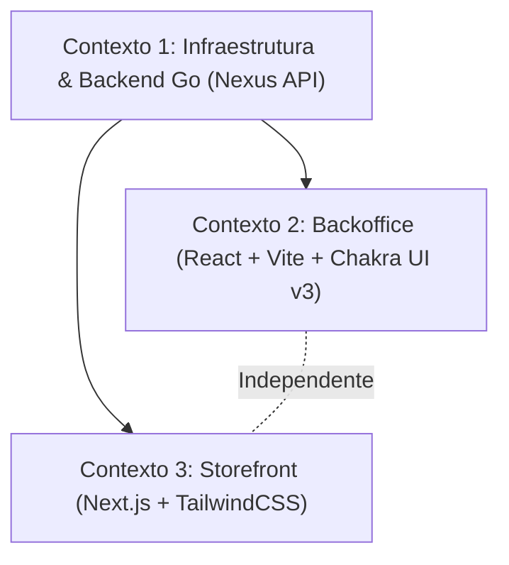

# 📐 Plano de Execução Técnica: Release 0 — Infraestrutura e Base Técnica do Monorepo

Este plano de execução técnica foi estruturado pelo **Nexus Tech Planner** com base no [ROADMAP.MD](file:///home/rodrigo/devs/nexus-commerce-monorepo/docs/ROADMAP.MD), respeitando integralmente as restrições arquiteturais definidas em [RESTRICTIONS.md](file:///home/rodrigo/devs/nexus-commerce-monorepo/rules/RESTRICTIONS.md) e as convenções técnicas de [PROJECT.MD](file:///home/rodrigo/devs/nexus-commerce-monorepo/docs/PROJECT.MD).

---

## 1. Visão Geral e Estratégia de Contextos

- **Objetivo da Entrega:** Estabelecer a fundação técnica completa do monorepo — infraestrutura de banco de dados conteinerizada, arquitetura modular da API Go em Raw SQL e os scaffolds isolados dos dois clientes frontend (Backoffice e Storefront) com testes automatizados configurados.
- **Nível de Complexidade:** **Complexa** (Setup multi-stack: Infra + Backend Go + 2 Frontends independentes).
- **Estratégia de Contextos:** Dividida obrigatoriamente em **3 sessões/contextos isolados** para garantir foco, evitar exaustão de contexto e respeitar a segregação de responsabilidades entre agentes.
- **Grafo de Dependência:**



---

## 2. Checklist Técnico Global (`[ ]`)

### Infraestrutura & Banco de Dados
- [ ] Criar `compose.yml` na raiz com serviço PostgreSQL (compatível com Podman).
- [ ] Criar `Makefile` na raiz com comandos `run`, `build` e `migrate`.
- [ ] Criar migração inicial de banco em `backend/migrations/01-initial-setup.sql`.

### Backend (Nexus API em Go)
- [ ] Inicializar módulo Go `github.com/nexus-commerce/backend` em `backend/go.mod`.
- [ ] Criar `backend/config/environments.go` e `backend/config.toml` para gestão de variáveis de ambiente.
- [ ] Criar conexão com pool PostgreSQL nativo via `database/sql` e `github.com/lib/pq` em `backend/postgres/connection.go`.
- [ ] Definir contrato de persistência `Storage` e struct `Store` em `backend/postgres/store.go`.
- [ ] Criar estrutura base de serviços e helpers HTTP em `backend/service/service.go`.
- [ ] Criar utilitários de criptografia e placeholder de hashing em `backend/utils/crypto.go`.
- [ ] Configurar roteador Gin e grupos de rota (`/api/store`, `/api/admin`, `/health`) em `backend/routers/routers.go`.
- [ ] Implementar inicialização do servidor HTTP e injeção de dependências em `backend/cmd/api.go`.
- [ ] Implementar ponto de entrada principal em `backend/main.go`.

### Backoffice (React + Vite + TypeScript + Chakra UI v3)
- [x] Scaffold do projeto em `apps/frontend/backoffice/` com Vite, React e TypeScript.
- [x] Instalar e configurar Chakra UI v3 e `@emotion/react`.
- [x] Configurar alias de path `@/*` em `tsconfig.app.json` e `vite.config.ts`.
- [x] Criar Design System de tokens em `src/shared/theme/tokens.ts`.
- [x] Criar componentes compartilhados base: `Layout`, `Header` e `Container` seguindo arrow functions e convenção kebab-case.
- [x] Configurar Jest + React Testing Library com testes unitários em pasta `__tests__` para cada componente base.

### Storefront (Next.js + TypeScript + TailwindCSS)
- [x] Scaffold do projeto em `apps/frontend/storefront/` com Next.js e TypeScript.
- [x] Instalar e configurar TailwindCSS e PostCSS.
- [x] Criar Design Tokens em `src/shared/theme/tokens.ts`.
- [x] Criar componentes compartilhados base: `Layout`, `Header` e `Container` com arrow functions e convenção kebab-case.
- [x] Configurar Jest + React Testing Library com testes unitários em pasta `__tests__` para cada componente base.

---

## 3. Prompts de Execução para Agentes (Ready-to-Run)

### Contexto 1: Infraestrutura & Backend Go (Nexus API)

Copie e execute o prompt abaixo na sessão do **backend-specialist**:

```markdown
### AGENTE ALVO: backend-specialist

Você deve implementar a fundação de infraestrutura e o scaffold completo da Nexus API em Golang conforme a Release 0 do Roadmap.

#### Contexto & Dependências
- Raiz do repositório: monorepo vazio em relação a código executável.
- Regras Mandatórias: Proibido o uso de ORMs (usar exclusivamente `database/sql` com `github.com/lib/pq`). Proibido commits autônomos. Código e identificadores estritamente em Inglês.
- Skills Obrigatórias a seguir:
  - `skills/backend/golang-api-architecture/SKILL.md`
  - `skills/backend/golang-database-repository/SKILL.md`
  - `skills/best-practices/cleancode/SKILL.md`
  - `rules/RESTRICTIONS.md`

#### Instruções Técnicas
1. **Infraestrutura**:
   - Criar `compose.yml` na raiz configurando o PostgreSQL (imagem `postgres:16-alpine`, porta 5432, banco `nexus_commerce`, usuário `nexus_user`, senha `nexus_pass`, volume para persistência).
   - Criar `Makefile` na raiz com targets:
     - `run`: executa `go run main.go` dentro de `backend/`.
     - `build`: compila o binário em `backend/bin/api`.
     - `migrate`: script ou comando que aplica os scripts SQL de `backend/migrations/` no banco via psql/container.

2. **Backend (pasta `backend/`)**:
   - Inicializar módulo Go: `go mod init github.com/nexus-commerce/backend`.
   - Adicionar dependências: `github.com/gin-gonic/gin`, `github.com/lib/pq`, `github.com/pelletier/go-toml/v2`.
   - Criar `backend/config.toml` contendo configurações do servidor (`port = "8080"`) e do banco (`host`, `port`, `user`, `password`, `dbname`, `sslmode`).
   - Criar `backend/config/environments.go` com struct `AppConfig` e função `LoadConfigEnv() (AppConfig, error)`.
   - Criar `backend/postgres/connection.go` com `NewDBConnection(cfg config.AppConfig) *sql.DB` utilizando `db.Ping()` e logs via `log/slog`.
   - Criar `backend/postgres/store.go` definindo a interface `Storage` (com método inicial `Ping(ctx context.Context) error`) e a struct `Store` que encapsula `*sql.DB` e `config.AppConfig`.
   - Criar `backend/service/service.go` com struct `Service`, construtor `NewService(store postgres.Storage, cfg config.AppConfig)`, método `HandleHealthCheck(c *gin.Context)` e helpers padronizados de resposta JSON e log (`slog`).
   - Criar `backend/utils/crypto.go` com stubs tipados para hashing futuro (ex: `HashPassword`, `CheckPasswordHash`).
   - Criar `backend/routers/routers.go` com função `Register(svc *service.Service, r *gin.Engine)` mapeando:
     - `GET /health` -> `svc.HandleHealthCheck`
     - Grupos vazios prontos para as próximas releases: `/api/store` e `/api/admin`.
   - Criar `backend/cmd/api.go` com `APIServer` struct, `NewAPIServer(cfg config.AppConfig, db *sql.DB) *APIServer` e método `Run() error`.
   - Criar `backend/main.go` orquestrando o bootstrap: carregamento de config, abertura de pool postgres, instanciação e execução do APIServer.
   - Criar migração inicial `backend/migrations/01-initial-setup.sql` criando a extensão `pgcrypto` ou `uuid-ossp`.

#### Validação & Critério de Sucesso
- Executar `podman compose up -d` (ou `docker compose up -d`) e verificar que o container PostgreSQL está healthy.
- Executar `make run` ou `go run main.go` a partir de `backend/`.
- Fazer requisição HTTP `GET http://localhost:8080/health` e receber resposta JSON `{"status": "ok", "database": "connected"}` com HTTP 200.
```

---

### Contexto 2: Backoffice Admin UI (React + Vite + Chakra UI v3)

Copie e execute o prompt abaixo na sessão do **frontend-specialist**:

```markdown
### AGENTE ALVO: frontend-specialist

Você deve construir o scaffold e a arquitetura base da aplicação Backoffice do Nexus Commerce.

#### Contexto & Dependências
- Contexto: A infraestrutura e backend já estão configurados no monorepo.
- Localização: Diretório `frontend/backoffice/`.
- Regras Mandatórias: Usar React + Vite + TypeScript + Chakra UI v3 + Jest. Proibido o uso de classes (usar exclusivamente funções e arrow functions). Nomenclatura de arquivos e pastas estritamente em `kebab-case`. Proibido instalar TailwindCSS no Backoffice (restrito ao Storefront).
- Skills Obrigatórias a seguir:
  - `skills/frontend/architecture-agent/SKILL.md`
  - `skills/frontend/simplicity-and-structural-conventions/SKILL.md`
  - `skills/frontend/design/SKILL.md`
  - `skills/frontend/web-interface-guidelines/SKILL.md`
  - `rules/RESTRICTIONS.md`

#### Instruções Técnicas
1. **Scaffold do Projeto**:
   - Inicializar em `frontend/backoffice` usando Vite template `react-ts`.
   - Instalar Chakra UI v3 (`@chakra-ui/react`, `@emotion/react`).
   - Configurar paths alias `@/*` apontando para `src/*` em `tsconfig.app.json` e `vite.config.ts` (usando `vite-tsconfig-paths`).

2. **Estrutura de Pastas**:
   - Criar:
     - `src/pages/`
     - `src/shared/components/`
     - `src/shared/utils/`
     - `src/shared/theme/`

3. **Design Tokens (`src/shared/theme/tokens.ts`)**:
   - Exportar tokens estruturados para `colors`, `spacing`, `typography`, `radius` e `shadows` adequados a um painel administrativo moderno e sóbrio.

4. **Componentes Base Reutilizáveis (`src/shared/components/`)**:
   - Criar `layout/layout.tsx`: estrutura padrão de painel administrativo com container central e área de header.
   - Criar `header/header.tsx`: barra superior do backoffice com título institucional ("Nexus Backoffice") e indicador de status.
   - Criar `container/container.tsx`: wrapper responsivo para o conteúdo.
   - Cada pasta de componente deve conter seu arquivo principal e sua subpasta `__tests__/` com teste em Jest.
   - Seguir: Arrow functions, optional chaining (`?.`), early returns, sem `constructor` ou classes.

5. **Página Inicial Placeholder (`src/pages/home/`)**:
   - Criar `src/pages/home/index.tsx` utilizando `Layout`, `Header` e `Container`.
   - Adicionar teste unitário em `src/pages/home/__tests__/home.test.tsx`.

6. **Configuração de Testes**:
   - Configurar `jest`, `ts-jest`, `@testing-library/react`, `@testing-library/jest-dom`.
   - Criar script `"test": "jest"` no `package.json`.

#### Validação & Critério de Sucesso
- Executar `npm run build` dentro de `frontend/backoffice` sem erros de tipagem TypeScript.
- Executar `npm test` e verificar que todos os testes unitários de `Layout`, `Header`, `Container` e `Home` passam com sucesso.
```

---

### Contexto 3: Storefront Vitrine UI (Next.js + TailwindCSS)

Copie e execute o prompt abaixo na sessão do **frontend-specialist**:

```markdown
### AGENTE ALVO: frontend-specialist

Você deve construir o scaffold e a arquitetura base da aplicação Storefront (vitrine pública de e-commerce) do Nexus Commerce.

#### Contexto & Dependências
- Contexto: A infraestrutura, backend e backoffice já possuem suas bases arquiteturais.
- Localização: Diretório `frontend/storefront/`.
- Regras Mandatórias: Usar Next.js + TypeScript + TailwindCSS + Jest. Proibido instalar Chakra UI ou Emotion no Storefront (isolamento estrito de dependências). Arrow functions obrigatórias, sem classes. Pastas e arquivos em `kebab-case`.
- Skills Obrigatórias a seguir:
  - `skills/frontend/architecture-agent/SKILL.md`
  - `skills/frontend/simplicity-and-structural-conventions/SKILL.md`
  - `skills/frontend/design/SKILL.md`
  - `skills/frontend/web-interface-guidelines/SKILL.md`
  - `rules/RESTRICTIONS.md`

#### Instruções Técnicas
1. **Scaffold do Projeto**:
   - Inicializar aplicação Next.js com TypeScript e TailwindCSS na pasta `frontend/storefront`.
   - Configurar `tailwind.config.ts` e `postcss.config.mjs`.
   - Configurar path alias `@/*` para `src/*` em `tsconfig.json`.

2. **Estrutura de Pastas**:
   - Organizar a estrutura em `src/`:
     - `src/pages/`
     - `src/shared/components/`
     - `src/shared/utils/`
     - `src/shared/theme/`

3. **Design Tokens (`src/shared/theme/tokens.ts`)**:
   - Definir tokens base de cores, espaçamentos, tipografia e bordas alinhados à identidade de vitrine pública de alto padrão, mapeados nas classes do Tailwind.

4. **Componentes Base Reutilizáveis (`src/shared/components/`)**:
   - Criar `layout/layout.tsx`: casca visual pública com header e container de conteúdo.
   - Criar `header/header.tsx`: cabeçalho da loja virtual com logotipo "Nexus Commerce", navegação e placeholder de carrinho.
   - Criar `container/container.tsx`: invólucro responsivo com padding e max-width padronizados.
   - Criar pasta `__tests__/` dentro de cada componente com seus respectivos testes em Jest/React Testing Library.
   - Padrão de código: Arrow functions puras, early returns, optional chaining (`?.`).

5. **Página Inicial Placeholder (`src/pages/home/` ou `src/app/page.tsx`)**:
   - Renderizar o layout padrão com uma mensagem de boas-vindas à vitrine ("Welcome to Nexus Commerce").
   - Adicionar teste unitário validando renderização.

6. **Configuração de Testes**:
   - Configurar Jest com suporte a Next.js (`next/jest`), `@testing-library/react` e `@testing-library/jest-dom`.
   - Script `"test": "jest"` funcional no `package.json`.

#### Validação & Critério de Sucesso
- Executar `npm run build` em `frontend/storefront` sem erros de compilação.
- Executar `npm test` garantindo que todos os testes unitários executem e passem com 100% de sucesso.
```
