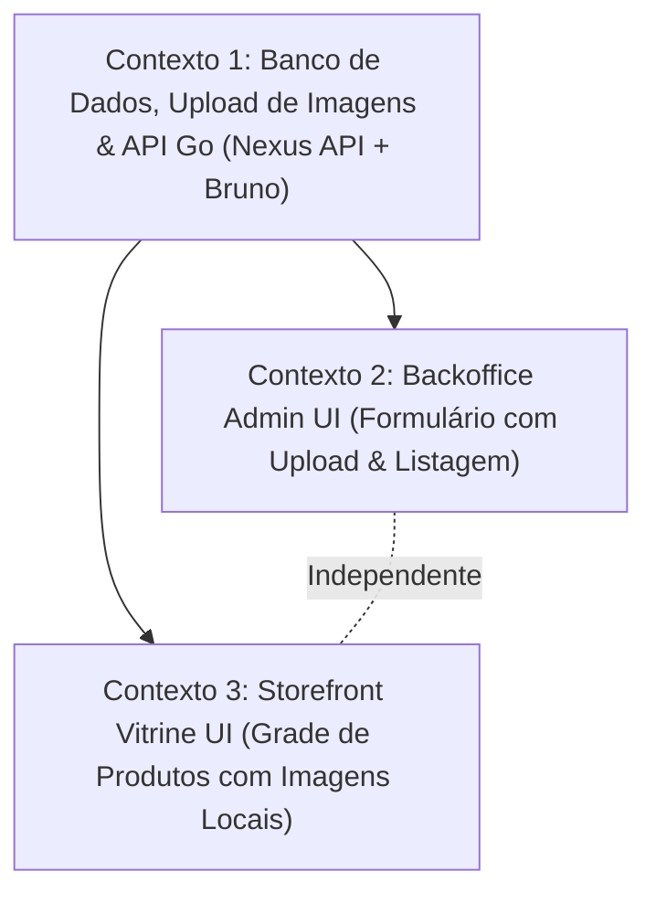

# 📐 Plano de Execução Técnica: Release 1 — Catálogo Digital Mínimo Viável (MVP)

Este plano de execução técnica foi estruturado pelo **Nexus Tech Planner** com base no [ROADMAP.MD](file:///home/rodrigo/devs/nexus-commerce-monorepo/docs/ROADMAP.MD), respeitando integralmente as restrições arquiteturais definidas em [RESTRICTIONS.md](file:///home/rodrigo/devs/nexus-commerce-monorepo/rules/RESTRICTIONS.md) e as convenções técnicas de [PROJECT.MD](file:///home/rodrigo/devs/nexus-commerce-monorepo/docs/PROJECT.MD).

---

## 1. Visão Geral e Estratégia de Contextos

- **Objetivo da Entrega:** Implementar a jornada ponta a ponta (end-to-end) de catálogo de produtos sem autenticação prévia:
  - Modelagem relacional e migração SQL versionada da tabela `products` em PostgreSQL.
  - Endpoints da API Go em Raw SQL para cadastro administrativo com upload local de imagens (`multipart/form-data`) e listagens para Backoffice e Storefront.
  - Servidor estático embutido no Gin para servir os arquivos enviados em `/uploads/*`.
  - Coleção de requisições oficiais no **Bruno** com asserções automatizadas.
  - Interface do Backoffice com formulário para envio de arquivo de imagem, preview e tabela de gestão.
  - Vitrine pública no Storefront consumindo e renderizando o catálogo com imagens locais da API.
- **Nível de Complexidade:** **Complexa** (Atinge DB PostgreSQL, Nexus API com upload de arquivos, Static File Server, Coleção Bruno, Backoffice React/Vite/Chakra UI e Storefront Next.js/TailwindCSS).
- **Quantidade de Contextos/Sessões:** **3 Contextos Isolados**.
- **Grafo de Dependência:**



---

## 2. Checklist Técnico Global (`[ ]`)

### Banco de Dados & Infraestrutura Local
- [ ] Criar migração versionada `02-create-products.sql` na pasta `apps/backend/migrations/` definindo a tabela `products`.
- [ ] Criar diretório `apps/backend/uploads/` com arquivo `.gitkeep`.
- [ ] Atualizar `.gitignore` na raiz para ignorar os arquivos de upload (`apps/backend/uploads/*`), mantendo `.gitkeep`.
- [ ] Executar migração no container PostgreSQL via `make migrate`.

### Backend (Nexus API em Go)
- [ ] Adicionar suporte a arquivos estáticos no Gin em `apps/backend/routers/routers.go` mapeando rota `/uploads` para `./uploads`.
- [ ] Modelar a struct `Product` e implementar métodos de acesso a dados nativos (`CreateProduct` e `ListProducts`) em `apps/backend/postgres/products.go`.
- [ ] Atualizar contrato da interface `Storage` em `apps/backend/postgres/store.go`.
- [ ] Implementar validação de arquivos de imagem (tamanho máx. 5MB, MIME types permitidos) e handlers HTTP em `apps/backend/service/products.go`.
- [ ] Registrar rotas HTTP:
  - `POST /api/admin/products` (cadastro com multipart/form-data)
  - `GET /api/admin/products` (listagem para lojistas)
  - `GET /api/store/products` (listagem pública)
- [ ] Criar arquivos de requisição no Bruno em `apps/backend/bruno/`:
  - `apps/backend/bruno/admin/Create Product.bru`
  - `apps/backend/bruno/admin/List Products.bru`
  - `apps/backend/bruno/store/List Products.bru`

### Backoffice (React 19 + Vite 8 + Chakra UI v3)
- [ ] Criar serviço de API para catálogo (`src/shared/services/products.ts`) com suporte a `FormData`.
- [ ] Implementar formulário de cadastro de produtos com input de arquivo, preview da imagem e validação visual de campos obrigatórios.
- [ ] Implementar tabela de listagem interna de produtos com thumbnail da imagem, nome, preço e data.
- [ ] Criar testes unitários com Jest e Testing Library para formulário e listagem.

### Storefront (Next.js 16 + React 19 + TailwindCSS)
- [ ] Criar cliente de catálogo e helper de resolução de URL de imagens em `src/shared/services/catalog.ts`.
- [ ] Implementar componente `ProductCard` com exibição de imagem e fallback visual.
- [ ] Implementar componente `ProductGrid` com tratamento de loading e empty state.
- [ ] Integrar a vitrine real na página inicial (`src/app/page.tsx`).
- [ ] Criar testes unitários com Jest e Testing Library para `ProductCard` e `ProductGrid`.

---

## 3. Prompts de Execução para Agentes (Ready-to-Run)

### Contexto 1: Banco de Dados, Upload de Imagens & API Go (Nexus API + Bruno)

```markdown
### AGENTE ALVO: backend-specialist

Você deve implementar a persistência de produtos, upload local de imagens, rotas REST e coleções de teste do Bruno da Release 1 do Nexus Commerce.

#### Contexto & Dependências
- Repositório: monorepo com setup da Release 0 funcional.
- Diretório de trabalho: `apps/backend/`.
- Regras Críticas:
  - Proibido uso de ORMs (usar estritamente `database/sql` com `github.com/lib/pq`).
  - Proibido alterar arquivos de migração já existentes (`01-initial-setup.sql`).
  - Proibido implementar autenticação (Login/JWT) nesta release.
  - Imagens de produtos devem ser recebidas via `multipart/form-data`, validadas e salvas localmente em `apps/backend/uploads/`.
  - Gin deve expor static serving para a pasta de uploads (`/uploads`).
  - Obrigatoriedade do Bruno: criar arquivos `.bru` com asserções para todos os endpoints criados.
- Skills Obrigatórias a consultar:
  - `skills/backend/golang-database-repository/SKILL.md`
  - `skills/backend/golang-api-architecture/SKILL.md`
  - `skills/backend/golang-clean-code-patterns/SKILL.md`
  - `skills/backend/golang-error-handling/SKILL.md`
  - `skills/backend/bruno-collection-generator/SKILL.md`
  - `skills/backend/bruno-test-writer/SKILL.md`
  - `rules/RESTRICTIONS.md`

#### Instruções Técnicas
1. **Estrutura de Pastas e Git**:
   - Criar o diretório `apps/backend/uploads/` contendo um arquivo `.gitkeep`.
   - Atualizar a raiz do `.gitignore` adicionando:
     ```gitignore
     # Uploads locais
     apps/backend/uploads/*
     !apps/backend/uploads/.gitkeep
     ```

2. **Migração SQL (`apps/backend/migrations/02-create-products.sql`)**:
   - Criar arquivo `02-create-products.sql`:
     ```sql
     CREATE TABLE IF NOT EXISTS products (
         id UUID PRIMARY KEY DEFAULT gen_random_uuid(),
         name VARCHAR(255) NOT NULL,
         description TEXT NOT NULL DEFAULT '',
         price NUMERIC(10, 2) NOT NULL CHECK (price >= 0),
         image_url TEXT NOT NULL DEFAULT '',
         created_at TIMESTAMP WITH TIME ZONE DEFAULT CURRENT_TIMESTAMP,
         updated_at TIMESTAMP WITH TIME ZONE DEFAULT CURRENT_TIMESTAMP
     );
     ```

3. **Repositório SQL Nativo (`apps/backend/postgres/`)**:
   - Criar `apps/backend/postgres/products.go`:
     - Definir struct `Product` com campos `ID` (string/uuid), `Name` (string), `Description` (string), `Price` (float64), `ImageURL` (string), `CreatedAt` (time.Time), `UpdatedAt` (time.Time).
     - Implementar `(s *Store) CreateProduct(ctx context.Context, p *Product) (*Product, error)` usando `INSERT INTO products ... RETURNING id, created_at, updated_at`.
     - Implementar `(s *Store) ListProducts(ctx context.Context) ([]Product, error)` ordenando por `created_at DESC`.
   - Atualizar a interface `Storage` em `apps/backend/postgres/store.go` adicionando `CreateProduct` e `ListProducts`.

4. **Upload e Handlers de Serviço (`apps/backend/service/`)**:
   - Criar `apps/backend/service/products.go`:
     - Função auxiliar de validação de imagem: verificar se o arquivo não excede 5MB e se o MIME type (ou extensão) é compatível (`image/jpeg`, `image/png`, `image/webp`).
     - Função para gerar nome de arquivo único (`uuid.New().String() + ext`) e salvar em `./uploads/`.
     - `HandleCreateProduct(c *gin.Context)`:
       - Extrair campos do form: `name` (obrigatório), `price` (obrigatório, float > 0), `description` (opcional).
       - Extrair arquivo do campo `image`. Se presente, validar e salvar em `./uploads/`, definindo `image_url` como `/uploads/<filename>`.
       - Se nenhum arquivo for enviado ou falhar na validação, retornar erro 400 apropriado.
       - Invocar `store.CreateProduct` e retornar HTTP 201 via `HandleResponseAPIOK`.
     - `HandleListProducts(c *gin.Context)`:
       - Invocar `store.ListProducts` e retornar HTTP 200 via `HandleResponseAPIOK`.

5. **Servidor Estático e Roteamento (`apps/backend/routers/routers.go`)**:
   - Registrar rota estática: `r.Static("/uploads", "./uploads")`.
   - Em `/api/admin`:
     - `POST /products` -> `svc.HandleCreateProduct`
     - `GET /products` -> `svc.HandleListProducts`
   - Em `/api/store`:
     - `GET /products` -> `svc.HandleListProducts`

6. **Coleções no Bruno (`apps/backend/bruno/`)**:
   - Em `apps/backend/bruno/admin/Create Product.bru`:
     - Método POST para `{{baseUrl}}/api/admin/products`
     - Configuração `body: multipart-form` contendo `name`, `price`, `description` e `image`.
     - Asserções: status 201, `res.body.success: eq true`, `res.body.data.id: isDefined`.
   - Em `apps/backend/bruno/admin/List Products.bru`:
     - Método GET para `{{baseUrl}}/api/admin/products`
     - Asserções: status 200, `res.body.data: isArray`.
   - Em `apps/backend/bruno/store/List Products.bru`:
     - Método GET para `{{baseUrl}}/api/store/products`
     - Asserções: status 200, `res.body.data: isArray`.

#### Validação & Critério de Sucesso
- Executar `make migrate` a partir de `apps/backend` e validar a criação da tabela `products`.
- Compilar com `make build` e iniciar o servidor com `make run`.
- Enviar requisição multipart via Bruno ou cURL com um arquivo de imagem de teste e confirmar que:
  1. O arquivo foi salvo fisicamente em `apps/backend/uploads/`.
  2. O registro foi criado no PostgreSQL com `image_url` apontando para `/uploads/<filename>`.
  3. A URL estática `http://localhost:8080/uploads/<filename>` responde HTTP 200 servindo a imagem.
```

---

### Contexto 2: Backoffice Admin UI (Formulário com Upload & Listagem)

```markdown
### AGENTE ALVO: frontend-specialist

Você deve implementar o módulo de cadastro e listagem interna de produtos no Backoffice, suportando o upload de imagem via multipart.

#### Contexto & Dependências
- Contexto: A API Go disponibiliza `POST /api/admin/products` (multipart/form-data) e `GET /api/admin/products` em `http://localhost:8080`. Imagens salvas são acessíveis via `http://localhost:8080/uploads/*`.
- Diretório de trabalho: `apps/frontend/backoffice/`.
- Regras Críticas:
  - Usar React 19 + Vite 8 + TypeScript + Chakra UI v3 + Jest.
  - Proibido o uso de TailwindCSS (restrito ao Storefront).
  - Proibido implementar Login/Logout/JWT nesta release.
  - Nomenclatura em `kebab-case`, arrow functions obrigatórias.
- Skills Obrigatórias a consultar:
  - `skills/frontend/architecture-agent/SKILL.md`
  - `skills/frontend/simplicity-and-structural-conventions/SKILL.md`
  - `skills/frontend/design/SKILL.md`
  - `skills/frontend/web-interface-guidelines/SKILL.md`
  - `rules/RESTRICTIONS.md`

#### Instruções Técnicas
1. **Tipos e Serviço de API (`src/shared/services/products.ts`)**:
   - Definir interface `Product`:
     ```ts
     export interface Product {
       id: string
       name: string
       description: string
       price: number
       imageUrl: string
       createdAt: string
     }
     ```
   - Implementar `createAdminProduct(formData: FormData): Promise<Product>` enviando POST para `http://localhost:8080/api/admin/products`.
   - Implementar `fetchAdminProducts(): Promise<Product[]>` enviando GET para `http://localhost:8080/api/admin/products`.

2. **Formulário de Cadastro com Upload (`src/pages/products/components/product-form/`)**:
   - Inputs:
     - Nome do produto (text input, obrigatório)
     - Preço (number input, obrigatório)
     - Descrição (textarea)
     - Imagem do Produto: `<input type="file" accept="image/png, image/jpeg, image/webp" />`
   - Exibir miniatura de preview assim que o usuário selecionar a imagem no computador.
   - Ao submeter, instanciar `new FormData()`, anexar os campos e o arquivo selecionado (`formData.append('image', file)`).
   - Estados de feedback: desabilitar botão durante envio, exibir mensagem de sucesso ou toast de erro em caso de falha.

3. **Tabela de Listagem de Produtos (`src/pages/products/components/product-table/`)**:
   - Exibir lista com miniatura da imagem (resolvendo `http://localhost:8080` + `product.imageUrl`), nome do produto, preço formatado e data.
   - Tratar estados: Loading (skeleton/spinner), Empty State amigável e Error State com botão de tentar novamente.

4. **Página de Produtos (`src/pages/products/index.tsx`)**:
   - Integrar layout padrão com botão para abrir o modal/drawer de cadastro e a tabela de listagem atualizada reativamente após novo cadastro.
   - Adicionar link no Header ou navegação para acessar a tela de Produtos.

5. **Testes Unitários**:
   - Criar testes unitários em subpastas `__tests__/` para o formulário e a listagem com mocks de requisição HTTP.

#### Validação & Critério de Sucesso
- Executar `npm run build` em `apps/frontend/backoffice` sem erros TypeScript.
- Executar `npm test` garantindo 100% de sucesso.
- Abrir o Backoffice no navegador, selecionar um arquivo de imagem local, preencher os dados, cadastrar o produto e verificar se o produto e a miniatura aparecem na listagem.
```

---

### Contexto 3: Storefront Vitrine UI (Grade de Produtos com Imagens Locais)

```markdown
### AGENTE ALVO: frontend-specialist

Você deve implementar a vitrine pública de produtos no Storefront do Nexus Commerce consumindo o catálogo da API Go e renderizando as imagens locais servidas pelo backend.

#### Contexto & Dependências
- Contexto: A API Go disponibiliza `GET /api/store/products` e serve as imagens de produto em `http://localhost:8080/uploads/*`.
- Diretório de trabalho: `apps/frontend/storefront/`.
- Regras Críticas:
  - Usar Next.js 16 + React 19 + TypeScript + TailwindCSS + Jest.
  - Proibido importar Chakra UI ou Emotion.
  - Sem autenticação nesta release.
  - Arrow functions obrigatórias, arquivos em `kebab-case`.
- Skills Obrigatórias a consultar:
  - `skills/frontend/architecture-agent/SKILL.md`
  - `skills/frontend/simplicity-and-structural-conventions/SKILL.md`
  - `skills/frontend/design/SKILL.md`
  - `skills/frontend/web-interface-guidelines/SKILL.md`
  - `rules/RESTRICTIONS.md`

#### Instruções Técnicas
1. **Cliente de API e Resolução de Imagem (`src/shared/services/catalog.ts`)**:
   - Definir interface `Product` e função auxiliar `resolveImageUrl(path: string): string` que concatena a URL base da API (`http://localhost:8080`) com o caminho relativo `/uploads/...`.
   - Implementar `getStoreProducts(): Promise<Product[]>` buscando de `http://localhost:8080/api/store/products`.

2. **Componente `ProductCard` (`src/shared/components/product-card/product-card.tsx`)**:
   - Card com TailwindCSS:
     - Renderização da imagem do produto com aspect ratio adequado e fallback para imagem padrão quando indisponível.
     - Nome do produto e descrição truncada.
     - Preço formatado em destaque.
     - Botão de ação (ex: "View Details" ou "Add to Cart" desabilitado como preview para a Release 2).

3. **Componente `ProductGrid` (`src/shared/components/product-grid/product-grid.tsx`)**:
   - Grid responsivo (`grid grid-cols-1 sm:grid-cols-2 md:grid-cols-3 lg:grid-cols-4 gap-6`).
   - Estados visuais: Loading com skeletons pulsantes em Tailwind, Empty State amigável quando não houver produtos cadastrados.

4. **Integração na Página Inicial (`src/app/page.tsx`)**:
   - Exibir a grade com os dados reais do catálogo na seção `#catalog`.

5. **Testes Unitários**:
   - Criar testes unitários em subpastas `__tests__/` para `ProductCard` e `ProductGrid`.

#### Validação & Critério de Sucesso
- Executar `npm run build` em `apps/frontend/storefront` sem erros.
- Executar `npm test` com todos os testes passando.
- Iniciar a vitrine (`npm run dev`) e verificar se os produtos cadastrados com imagens no Backoffice são renderizados com suas respectivas fotos na vitrine.
```
