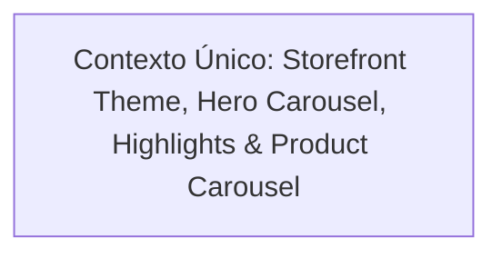

# 📐 Plano de Execução Técnica: Redesign do Storefront E-commerce (Tema Claro, Hero Carrossel & Vitrine)

Este plano de execução técnica foi formulado pelo **Nexus Tech Planner** com base nos requisitos de redesign do Storefront para transformar a interface pública em uma experiência de e-commerce moderna com tema claro, respeitando estritamente o Pages Router do Next.js, o padrão de SSR com `initialData` e as restrições arquiteturais definidas em [`rules/RESTRICTIONS.md`](../../rules/RESTRICTIONS.md).

---

## 1. Visão Geral e Estratégia de Contextos

- **Objetivo da Entrega:** Transformar a interface pública do Storefront em um e-commerce moderno e de alta conversão:
  0. **Tema Claro & Cores Leves:** Transição da estética escura para uma paleta clara e arejada com fundo branco/neutro (`#ffffff` / `#f8fafc`), tipografia escura com alto contraste (`#0f172a`), bordas sutis e acentos em azul/índigo suave.
  1. **Header Minimalista:** Exibição exclusiva do logotipo oficial ("Nexus Commerce") e botão de acesso ao carrinho de compras com badge de contagem de itens.
  2. **Carrossel Promocional (Hero Banner):** Componente rotativo de banners no topo da página inicial, com navegação por setas (anterior/próximo), indicadores clicáveis (dots) e temporizador automático.
  3. **Seção de Highlights (4 Promoções/Benefícios):** Grade responsiva com 4 cards de vantagens de e-commerce (Frete Grátis, Parcelamento Sem Juros, Desconto no Pix e Troca Garantida).
  4. **Carrossel de Produtos em Destaque:** Vitrine em formato de carrossel deslizante com no máximo **4 itens visíveis simultaneamente** no desktop (e responsivo para mobile/tablet), permitindo navegar pelos produtos disponíveis.
- **Nível de Complexidade:** **Média** (Atinge layout global, cabeçalho, novos componentes interativos do Storefront, tema CSS e suíte de testes do Jest).
- **Quantidade de Contextos/Sessões:** **1 Contexto Sequencial**.
- **Grafo de Dependência:**



---

## 2. Checklist Técnico Global (`[ ]`)

- [ ] **Tema Global & Paleta de Cores Claras (`apps/frontend/storefront/src/styles/`)**:
  - [ ] Atualizar `globals.css` para tema claro: `color-scheme: light`, `background-color: #f8fafc`, texto principal `#0f172a`.
  - [ ] Ajustar layout e container em `src/shared/components/Layout/` para suportar visual clean e rodapé claro.
- [ ] **Header Simplificado (`src/shared/components/Header/`)**:
  - [ ] Remover links secundários de navegação do miolo ("Catálogo", "Categorias", "Sobre").
  - [ ] Manter estritamente o logotipo à esquerda e o botão do carrinho com contador à direita.
  - [ ] Atualizar estilos do cabeçalho com fundo branco translúcido (`bg-white/90 backdrop-blur-md border-b border-slate-200/80`).
- [ ] **Carrossel Hero de Imagens (`src/shared/components/HeroCarousel/`)**:
  - [ ] Criar componente com slides de banners promocionais de alta qualidade visual.
  - [ ] Suportar navegação por setas laterais (anterior/próximo), indicadores clicáveis (dots) e autoplay com pausa.
  - [ ] Garantir acessibilidade com botões navegáveis e tags semânticas.
- [ ] **Cards de Highlights Promocionais (`src/shared/components/HighlightCards/`)**:
  - [ ] Criar grade responsiva de 4 cards informativos:
    1. *Frete Grátis*: Em pedidos acima de R$ 199.
    2. *Até 10x Sem Juros*: No cartão de crédito.
    3. *5% OFF no Pix*: Desconto instantâneo no checkout.
    4. *Troca & Devolução Grátis*: Até 30 dias de garantia.
  - [ ] Estilização com cartões brancos, bordas suaves e ícones representativos (`Truck`, `CreditCard`, `Percent`, `ShieldCheck`).
- [ ] **Carrossel de Produtos de no Máximo 4 Itens (`src/shared/components/ProductCarousel/`)**:
  - [ ] Criar componente de carrossel de produtos exibindo exatamente até 4 itens visíveis por página no desktop.
  - [ ] Controles de paginação (setas anterior/próximo e indicador numérico ou de página).
  - [ ] Atualizar `ProductCard` para tema claro (fundo branco, borda `border-slate-200`, sombra suave, tipografia escura).
  - [ ] Tratamento de estados de carregamento (*skeleton*) e lista vazia (*empty state*).
- [ ] **Integração na Página Inicial (`src/pages/index.tsx`)**:
  - [ ] Manter obrigatoriedade de SSR via `getServerSideProps` repassando `initialData` para `useStoreProducts`.
  - [ ] Integrar: `Header` ➔ `HeroCarousel` ➔ `HighlightCards` ➔ `ProductCarousel`.
- [ ] **Garantia de Qualidade & Testes**:
  - [ ] Atualizar suítes de testes unitários existentes em `__tests__/` para refletir os novos componentes e layout.
  - [ ] Executar `npm test` no Storefront garantindo 100% dos testes passando.
  - [ ] Executar `npm run build` garantindo SSR e compilação sem erros.

---

## 3. Prompts de Execução para Agentes (Ready-to-Run)

### Contexto 1: Storefront E-commerce Redesign (Tema Claro, Hero, Highlights & Carrossel)

```markdown
### AGENTE ALVO: frontend-specialist

Você deve implementar a reformulação visual e estrutural do Storefront do Nexus Commerce, aplicando a estética clássica de e-commerce com tema claro, header enxuto, hero banner rotativo, 4 cards de vantagens e carrossel de produtos com até 4 itens visíveis.

#### Contexto & Dependências
- Diretório de trabalho: `apps/frontend/storefront/`.
- Stack: Next.js 16 (Pages Router), React 19, TailwindCSS, TanStack Query e Lucide React.
- Regras Críticas:
  - Respeitar estritamente `rules/RESTRICTIONS.md`.
  - Manter padrão de SSR obrigatório: busca de produtos em `getServerSideProps` e consumo via `initialData` no hook `useStoreProducts`.
  - Storefront utiliza exclusivamente Next.js e TailwindCSS (proibido adicionar Chakra UI aqui).
  - Variáveis, funções e componentes estritamente em inglês; textos de tela e badges comerciais em português.
- Skills Obrigatórias a consultar:
  - `skills/frontend/react/SKILL.md`
  - `skills/frontend/design/SKILL.md`
  - `skills/frontend/web-interface-guidelines/SKILL.md`
  - `rules/RESTRICTIONS.md`

#### Instruções Técnicas

1. **Tema Claro Global (`src/styles/globals.css` e `Layout`)**:
   - Em `globals.css`:
     - Configurar `color-scheme: light;`
     - Background global do body para `#f8fafc` (slate-50) e cor de texto `#0f172a` (slate-900).
   - Atualizar `src/shared/components/Layout/styles.module.css` para paleta clara, com footer em cinza suave (`bg-white border-t border-slate-200 text-slate-600`).

2. **Header Minimalista (`src/shared/components/Header/`)**:
   - Em `src/shared/components/Header/index.tsx`:
     - Remover o menu de links de navegação (`navLink` "Catálogo", "Categorias", "Sobre").
     - Manter apenas o logotipo com link para `/` à esquerda e o botão de carrinho à direita.
   - Atualizar `styles.module.css` para visual e-commerce claro:
     - Header com fundo branco translúcido (`bg-white/90 backdrop-blur-md border-b border-slate-200 shadow-sm`).
     - Botão de carrinho em estilo pill ou botão com ícone `ShoppingBag`, contador em badge (`bg-blue-600 text-white font-bold`).

3. **Carrossel Hero Promocional (`src/shared/components/HeroCarousel/`)**:
   - Criar `src/shared/components/HeroCarousel/index.tsx` e `styles.module.css`:
     - Array de slides com promoções de e-commerce (ex: "Tecnologia de Alta Performance", "Novidades da Temporada com Frete Grátis", "Até 30% OFF em Acessórios").
     - Cada slide deve ter título atrativo, subtítulo convidativo, tag/badge promocional e botão CTA ("Conferir Ofertas", "Comprar Agora") com link `#produtos`.
     - Controles: botões de avançar/voltar (`ChevronLeft`, `ChevronRight`) e indicadores de slide (dots clicáveis).
     - Temporizador para transição suave automática com pausa ao interagir.

4. **Seção de Highlights (4 Cards Promocionais) (`src/shared/components/HighlightCards/`)**:
   - Criar `src/shared/components/HighlightCards/index.tsx` e `styles.module.css`:
     - Grade responsiva com 4 colunas (`grid grid-cols-1 sm:grid-cols-2 lg:grid-cols-4 gap-4`):
       1. **Frete Grátis Brasil:** Ícone `Truck` | Em compras acima de R$ 199.
       2. **Até 10x Sem Juros:** Ícone `CreditCard` | Parcelamento facilitado no cartão.
       3. **5% OFF no Pix:** Ícone `Percent` | Desconto imediato no checkout.
       4. **Garantia & Troca Fácil:** Ícone `ShieldCheck` | Até 30 dias para devolução grátis.
     - Cards com fundo branco, cantos arredondados (`rounded-xl`), borda sutil (`border border-slate-200`), ícones coloridos em tons suaves e tipografia moderna.

5. **Carrossel de Produtos de no Máximo 4 Itens (`src/shared/components/ProductCarousel/`)**:
   - Criar `src/shared/components/ProductCarousel/index.tsx` e `styles.module.css`:
     - Recebe a lista de produtos (`Product[]`), estado de loading e erro.
     - Exibe uma vitrine deslizante de até **4 itens por visualização no desktop** (`itemsPerPage = 4`).
     - Cabeçalho da seção com título "Ofertas em Destaque", subtítulo e botões de navegação lateral (seta esquerda/direita desabilitadas conforme início/fim da lista).
     - Renderiza os itens utilizando `ProductCard` adaptado para o tema claro (fundo branco, borda `border-slate-200`, preço em negrito azul/índigo e thumbnail limpa).
     - Tratamento para estado vazio quando não houver produtos cadastrados.

6. **Página Inicial (`src/pages/index.tsx`)**:
   - Atualizar a montagem da página:
     ```tsx
     <Layout>
       <HeroCarousel />
       <Container>
         <HighlightCards />
         <section id="produtos" className="my-12">
           <ProductCarousel products={products} isLoading={isLoading} error={errorMessage} />
         </section>
       </Container>
     </Layout>
     ```
   - Garantir que `getServerSideProps` continue buscando os produtos e alimentando o `initialData`.

7. **Testes Unitários & Validação**:
   - Atualizar/criar testes para `HeroCarousel`, `HighlightCards` e `ProductCarousel`.
   - Rodar `npm test` no Storefront e garantir que todos os testes passem.
   - Rodar `npm run build` no Storefront garantindo compilação e SSR livres de erros.

#### Critério de Sucesso
- Loja com estética de e-commerce real em tema claro (branco, slate e acentos sutis).
- Header contendo unicamente Logo e Carrinho.
- Hero Banner dinâmico com navegação em carrossel.
- 4 cards promocionais bem alinhados abaixo do hero.
- Carrossel de produtos exibindo exatamente até 4 itens simultâneos no desktop com navegação anterior/próximo.
- 100% dos testes e build passando.
```
