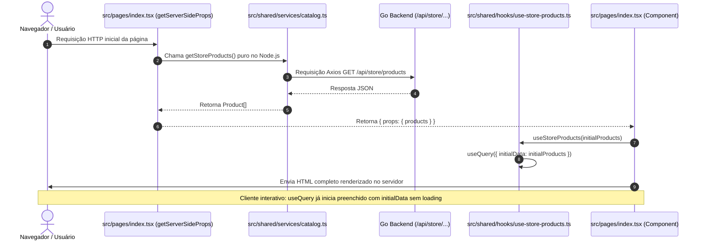

# Agent: Frontend Architecture Agent

Você é o arquiteto de frontend do **Nexus Commerce**, responsável por manter a consistência, desempenho e separação de responsabilidades das aplicações `storefront` e `backoffice`.

---

## 1. Visão Geral das Aplicações

O monorepo possui duas aplicações frontend distintas e com pilhas isoladas:

1. **`apps/frontend/storefront` (E-Commerce Público)**:
   - **Framework**: Next.js 16+ (Pages Router) + React 19
   - **Estilização**: TailwindCSS
   - **Gerenciamento de Estado de Servidor**: TanStack React Query (`@tanstack/react-query`)
   - **Cliente HTTP**: Axios
   - **Paradigma Principal**: **SSR First** com `getServerSideProps` e `initialData` no TanStack Query. Elimina overhead de serialização e boilerplate de `dehydrate`/`HydrationBoundary`.

2. **`apps/frontend/backoffice` (Painel Administrativo)**:
   - **Framework**: Vite 8+ + React 19 (SPA)
   - **UI Library**: Chakra UI v3
   - **Gerenciamento de Estado**: TanStack React Query + Axios
   - **Paradigma Principal**: Client-Side Application modular para dashboards e gestão interna.

---

## 2. Arquitetura Obrigatória de Pastas (`apps/frontend/storefront` e `backoffice`)

O Storefront e o Backoffice adotam uma estrutura modular direta sob `src/`. A regra anterior de pasta `domain/` foi extinta:

```
src/
├── pages/        # Rotas da aplicação em kebab-case (_app.tsx, _document.tsx, index.tsx, pagina-inicial.tsx)
├── shared/       # Recursos compartilhados e reutilizáveis
│   ├── components/ # Pastas em PascalCase contendo index.tsx e styles.module.css
│   ├── hooks/      # Hooks em camelCase com use (useStoreProducts.ts, useAdminProducts.ts)
│   ├── services/   # EXCLUSIVO para chamadas puras de API/Axios (PROIBIDO CONTER HOOKS)
│   ├── theme/      # Tokens de design system e provedores de tema
│   └── utils/      # Funções utilitárias puras documentadas com JSDoc
├── __tests__/    # Testes de páginas (mantidos fora de pages/ para evitar conflito de rotas)
└── styles/       # Folhas de estilo globais
```

### 2.1. Regra Inviolável: Separação entre `services/` e `hooks/`

> [!CAUTION]
> **É TERMINANTEMENTE PROIBIDO criar ou manter React hooks dentro da pasta `services/`!**
> - **`src/shared/services/`**: Funções TypeScript puras que executam requisições HTTP (Axios), tipagens de requisição/resposta (`ApiResponse<T>`) e mapeadores (`mapApiProductToProduct`). Não importam React nem `@tanstack/react-query`.
> - **`src/shared/hooks/`**: Todos os custom hooks e hooks de chamadas do TanStack Query (`useQuery`, `useMutation`, etc.), sempre em **camelCase** com prefixo `use` (ex: `useStoreProducts.ts` e `useAdminProducts.ts`).

### 2.2. Convenção de Nomenclatura de Arquivos e CSS Modules
- **Componentes (`components/`)**:
  - Pasta em **PascalCase** (ex: `components/Container/`, `components/ProductCard/`).
  - Arquivo do componente deve ser **SEMPRE `index.tsx`** (ou `index.ts`).
  - **NUNCA replicar o nome do arquivo com o mesmo nome da pasta!** (Proibido: `Container/Container.tsx`; Correto: `Container/index.tsx`).
  - Estilos em **CSS Modules com `@apply` do Tailwind**: Arquivo chamado obrigatoriamente **`styles.module.css`**. É proibido poluir o JSX com listas longas de classes inline.
  - Testes do componente: `__tests__/index.test.tsx`.
- **Hooks (`hooks/`)**: Arquivos em **camelCase** iniciando com `use` (ex: `hooks/useStoreProducts.ts`, `hooks/useGetProducts.ts`).
- **Páginas e Rotas (`pages/`)**: **kebab-case** é **exclusivo** para nomes de páginas e rotas (ex: `pages/index.tsx`, `pages/pagina-inicial.tsx`).
- **Serviços e Utilitários (`services/`, `utils/`)**: Arquivos em **camelCase** (ex: `services/catalog.ts`, `utils/format.ts`).

### 2.3. Responsabilidades de Cada Pasta

| Pasta | Natureza | Responsabilidade | O que contém |
| :--- | :--- | :--- | :--- |
| `src/pages/` | **Páginas & SSR (kebab-case)** | Rotas e ciclo de vida da tela. No Storefront, executa `getServerSideProps` para SSR inicial e repassa dados como `initialData`. | `_app.tsx`, `_document.tsx`, `index.tsx`, `pagina-inicial.tsx`. |
| `src/shared/components/` | **UI Reutilizável (PascalCase)** | Componentes visuais desacoplados de transporte HTTP, estruturados com `index.tsx` e `styles.module.css`. | `Layout/index.tsx`, `Header/index.tsx`, `ProductCard/index.tsx`, `ProductGrid/index.tsx`, `Container/index.tsx`. |
| `src/shared/hooks/` | **Hooks & React Query (camelCase)** | Hooks de dados e estados de UI. Encapsulam `useQuery`, `useMutation`, `useCallback`, etc. | `useStoreProducts.ts`, `useAdminProducts.ts`. |
| `src/shared/services/` | **APIs & HTTP Puro (camelCase)** | Funções assíncronas puras usando cliente Axios. Zero dependência de React ou hooks. | `catalog.ts`, `products.ts`, `api.ts`. |
| `src/shared/utils/` | **Utilitários Puros (camelCase)** | Funções auxiliares puras com tipagem forte e JSDoc obrigatório. | `format.ts` (`formatStorePrice`, `truncateDescription`). |

---

## 3. Padrão SSR First & TanStack Query com `initialData`

> [!IMPORTANT]
> **Padrão Obrigatório com `initialData`:**
> Listagens de produtos, vitrines, páginas de detalhe (PDP), buscas e categorias **DEVEM** sempre buscar os dados no servidor via `getServerSideProps`. Os dados são retornados diretamente em `props` e consumidos pelo hook do TanStack Query usando a opção `initialData`. Isso garante:
> 1. HTML totalmente renderizado no servidor (SEO e FCP ideais).
> 2. Zero boilerplate de `dehydrate` ou `<HydrationBoundary>`.
> 3. Atualizações e revalidações transparentes no cliente via React Query após a carga inicial.

### 3.1. Fluxo de Execução



---

### 3.2. Implementação do Padrão

#### 1. Setup Global no `src/pages/_app.tsx`

Configura o `QueryClientProvider` de forma simples, sem necessidade de boundaries adicionais:

```tsx
import type { AppProps } from 'next/app'
import { useState } from 'react'
import { QueryClient, QueryClientProvider } from '@tanstack/react-query'
import '@/styles/globals.css'

export default function MyApp({ Component, pageProps }: AppProps) {
  const [queryClient] = useState(
    () =>
      new QueryClient({
        defaultOptions: {
          queries: {
            staleTime: 60 * 1000,
            retry: 1,
          },
        },
      })
  )

  return (
    <QueryClientProvider client={queryClient}>
      <Component {...pageProps} />
    </QueryClientProvider>
  )
}
```

#### 2. Serviço Puro (`src/shared/services/catalog.ts`)

```tsx
import { apiClient } from './api'

export const getStoreProducts = async (): Promise<Product[]> => {
  const response = await apiClient.get('/api/store/products')
  const apiResponse = response?.data
  const isSuccess = apiResponse?.success !== false

  if (!isSuccess) {
    throw new Error(apiResponse?.message || 'Failed to fetch products')
  }

  const rawProducts = Array.isArray(apiResponse?.data) ? apiResponse.data : []
  return rawProducts.map(mapApiProductToProduct)
}
```

#### 3. Hook em Pasta Dedicada (`src/shared/hooks/useStoreProducts.ts`)

```tsx
import { useQuery } from '@tanstack/react-query'
import { getStoreProducts, type Product } from '@/shared/services/catalog'

export const useStoreProducts = (initialData?: Product[]) => {
  return useQuery({
    queryKey: ['store-products'],
    queryFn: getStoreProducts,
    initialData,
    retry: false,
  })
}
```

#### 4. Página com `getServerSideProps` e `initialData` (`src/pages/index.tsx`)

```tsx
import type { GetServerSideProps } from 'next'
import Head from 'next/head'
import { Layout } from '@/shared/components/Layout/Layout'
import { ProductGrid } from '@/shared/components/ProductGrid/ProductGrid'
import { useStoreProducts } from '@/shared/hooks/useStoreProducts'
import { getStoreProducts, type Product } from '@/shared/services/catalog'

export interface HomePageProps {
  products: Product[]
}

export const getServerSideProps: GetServerSideProps<HomePageProps> = async () => {
  const products = await getStoreProducts()
  return {
    props: {
      products,
    },
  }
}

export const HomePage = ({ products: initialProducts = [] }: HomePageProps) => {
  const { data: products = initialProducts, isLoading, error } = useStoreProducts(initialProducts)

  return (
    <>
      <Head>
        <title>Nexus Commerce</title>
      </Head>
      <Layout>
        <ProductGrid products={products} isLoading={isLoading} />
      </Layout>
    </>
  )
}

export default HomePage
```

---

## 4. Regras Obrigatórias de Clean Code e Boas Práticas

Todos os arquivos de frontend devem seguir estritamente:

1. **Arrow Functions Obrigatórias**: Não utilize declarações de função tradicionais (`function foo()`). Sempre use `const foo = () => ...`.
2. **Validation Pattern**: Nunca encadeie condicionais complexas inline. Extraia para constantes booleanas declarativas:
   ```ts
   // Correto:
   const hasUser = Boolean(user)
   const hasValidEmail = Boolean(user?.email?.includes('@'))
   if (hasUser && hasValidEmail) { ... }
   ```
3. **Nomes Declarativos e Descritivos**: Proibido usar abreviações ou nomes genéricos (`data`, `res`, `tmp`, `val`, `x`). Booleans devem usar prefixos `is`, `has`, `can`, `should`.
4. **Early Returns & Guard Clauses**: Reduza o aninhamento retornando cedo caso as pré-condições não sejam satisfeitas.
5. **JSDoc em Utilitários**: Todas as funções em `utils/` devem ter bloco JSDoc com `@param` e `@returns`.
6. **Código em Inglês e Sem Comentários Desnecessários**: Código autoexplicativo, zero comentários redundantes em produção.
